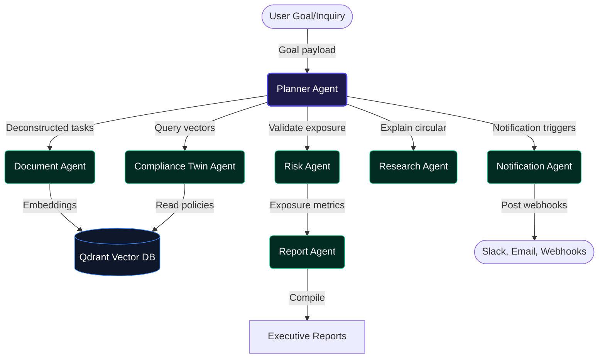

# RIO System Design

This document details the multi-agent system structure, sequence flow, and information pathways of the **RIO Compliance Operating System**.

---

## 1. Sequence Diagram: Multi-Agent Request Reasoning

This diagram details the transactional boundary when a user submits a goal (e.g., verifying database encryption parameters against SEC cybersecurity rules):

```mermaid
sequenceDiagram
    autonumber
    actor User as Compliance Officer
    participant FE as React Frontend
    participant GW as FastAPI Gateway
    participant PL as Planner Agent
    participant DOC as Document Agent
    participant TW as Compliance Twin Agent
    participant RK as Risk Agent
    participant DB as Vector DB (Qdrant)

    User->>FE: Submits goal: "Audit DB keys against SEC Rules"
    FE->>GW: POST /api/v1/planner/execute
    GW->>PL: process({"goal": "..."})
    PL->>PL: plan_execution() [Generates Node Chain]
    
    rect rgb(15, 23, 42)
        note right of PL: Execution Step 1: Document Parsing
        PL->>DOC: process()
        DOC->>DOC: Extract markdown & metadata entities
        DOC-->>PL: State: Cleaned markdown
    end
    
    rect rgb(15, 23, 42)
        note right of PL: Execution Step 2: Twin Evaluation & Vector Lookup
        PL->>TW: process()
        TW->>DB: Cosine Similarity queries (obligations)
        DB-->>TW: Returns matched policy blocks (AES-128 found)
        TW->>TW: Detects compliance discrepancy (SEC requires AES-256)
        TW-->>PL: State: Identified Gaps list
    end

    rect rgb(15, 23, 42)
        note right of PL: Execution Step 3: Risk exposure scoring
        PL->>RK: process()
        RK->>RK: Calculate readiness index & business impact
        RK-->>PL: State: Risk score & mitigation steps
    end

    PL-->>GW: Consolidated state with steps & telemetry logs
    GW-->>FE: HTTP Response (JSON logs & trace output)
    FE-->>User: Renders Chat output + AI Observability execution graph
```

---

## 2. Multi-Agent Topology

The following schema maps the collaborative communication topology of the RIO autonomous agents:

